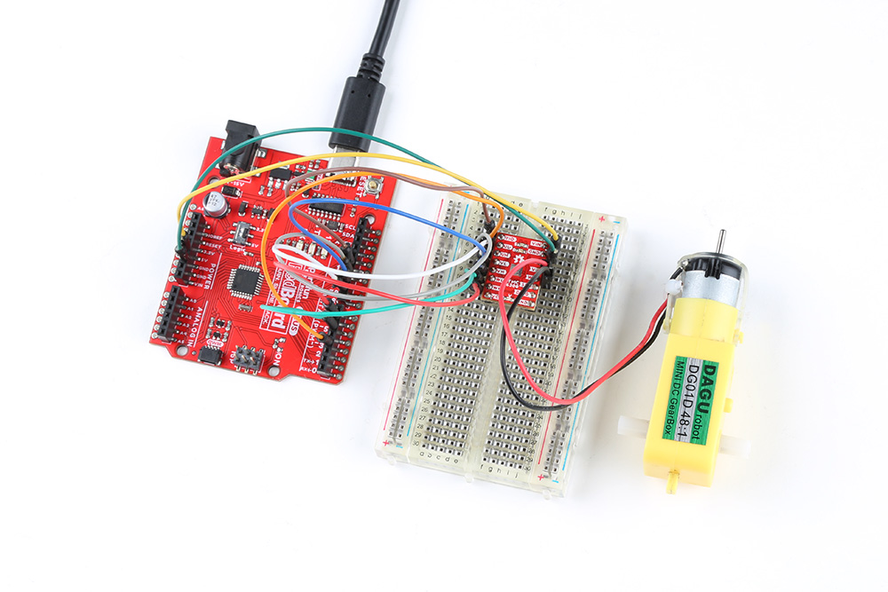

## Hardware Assembly

Users should already have followed the instructions from the [component assembly](../../component_assembly) and [example setups](../../hardware_assembly) sections to setup their hardware for this example.

<figure markdown>
[{ width="200" }](../img/hookup_guide/example-DC_motor.jpg "Click to enlarge")
<figcaption markdown>
A graphical representation of the connections between the [RedBoard Plus](https://www.sparkfun.com/products/18158) and a [breadboard](https://www.sparkfun.com/products/12002) with the [TMC6300 motor driver](https://www.sparkfun.com/products/21867) attached.
</figcaption>
</figure>


### RedBoard Plus to TMC6300

Connect the following pins from the RedBoard Plus to the TMC6300.

--8<-- "./docs/hardware_assembly.md:12:26"

### Connecting the DC Motor

--8<-- "./docs/hardware_assembly.md:71:71"

### Powering the TMC6300

If users are unable to find a suitable power source, we have found that the 5V power output from the RedBoard Plus is sufficient to drive the gimbal motor, under a no load condition at low speeds.

--8<-- "./docs/hardware_assembly.md:83:97"


## Example Code

After installing and setting up the Arduino IDE and the Simple FOC Arduino library, users will need to upload the following example code to the RedBoard Plus. This code can be copied or downloaded below:

<center>
[:octicons-download-16:{ .heart } Download `DC.ino` Example Code](../DC/DC.ino){ .md-button .md-button--primary }
</center>

!!! code "Example Code"
    ``` c++ title="DC.ino"
        --8<-- "./docs/arduino_examples/DC/DC.ino"
    ```

### Running the Motor

Be default, the motor should spin automatically. However, if users wish to control the motor, they can modify lines **30** and **33** of code and reprogram the RedBoard Plus. These lines control the high and low-side MOSFETS of the H-bridge directly through pins `5`, `6`, `9`, and `10`.

??? code "Code Changes Highlighted"
    MOdify the following lines of code (**30** and **33**):

    ``` c++ hl_lines="30 33" title="DC.ino"
        --8<-- "./docs/arduino_examples/DC/DC.ino"
    ```

* The PWM voltage value `driver.setPwm(voltage_value,0,0)` affects the speed of the motor.
* The position of this value inr elation to the PWM drive channel `driver.setPwm(channel_v,channel_w,0)` affects the direction.

??? tip
    Users may also be interested in the [SimpleDC Motor library](https://docs.simplefoc.com/dc_motors_library) to drive DC motors with the Simple FOC Arduino library.