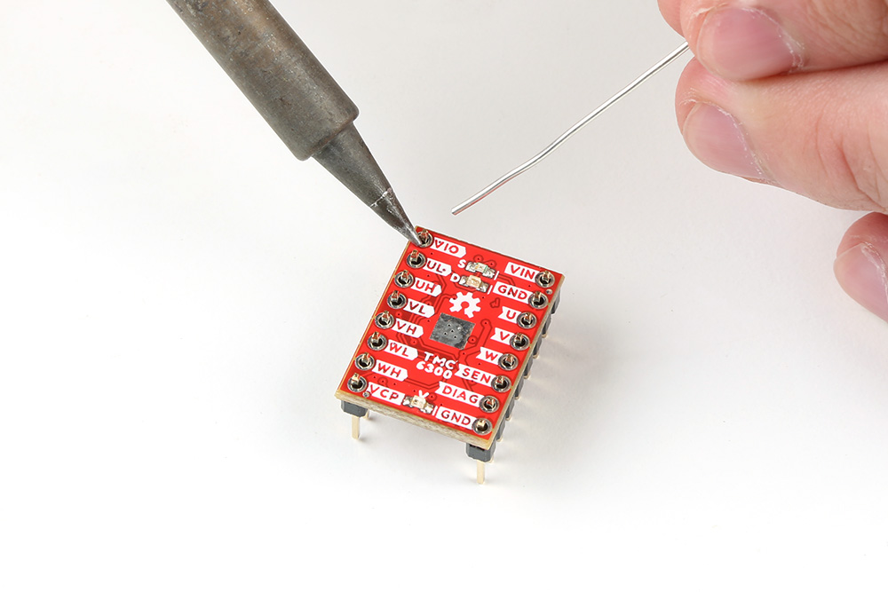
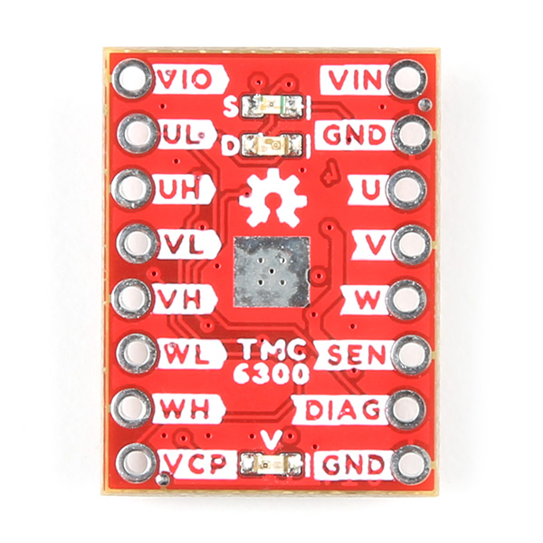
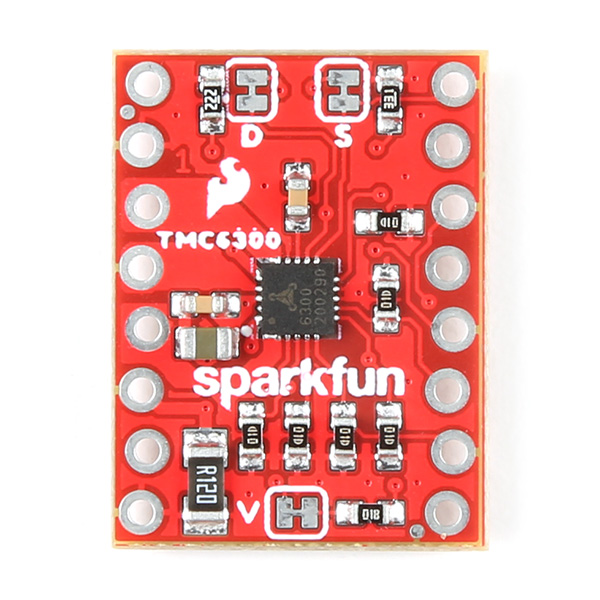
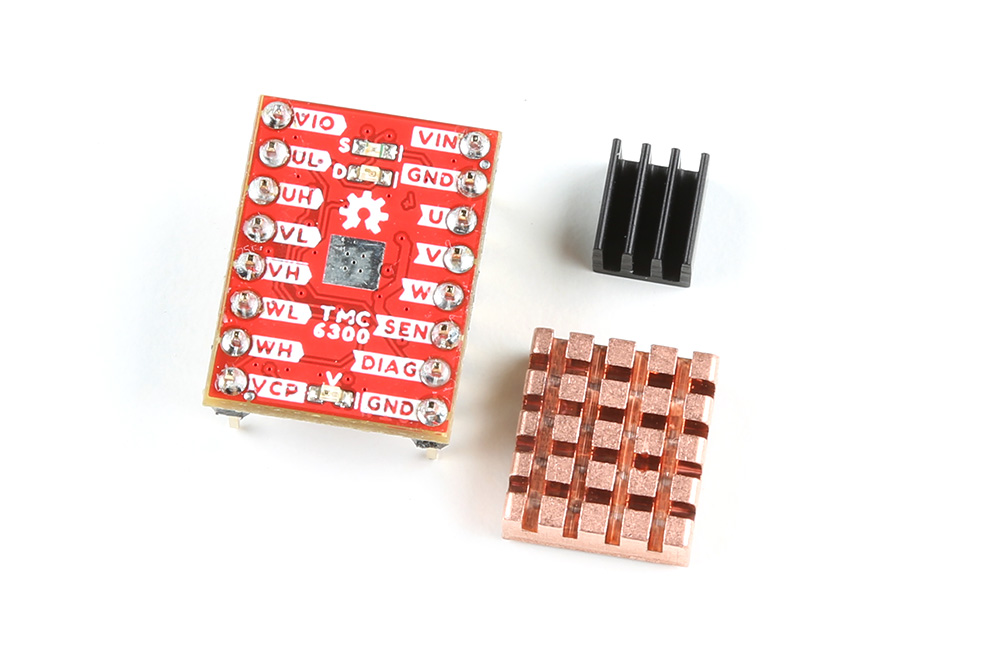
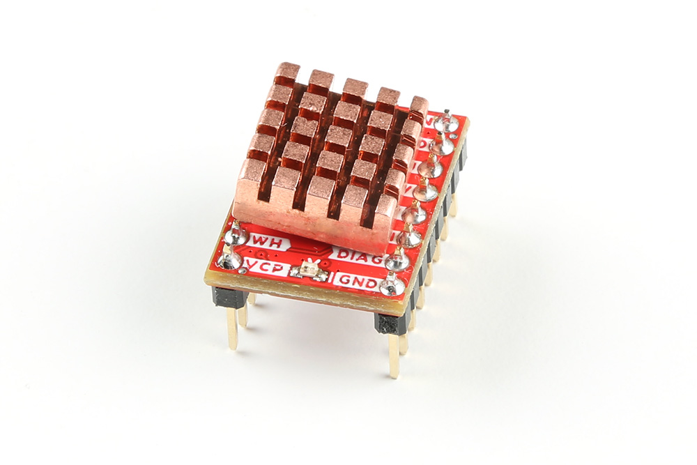
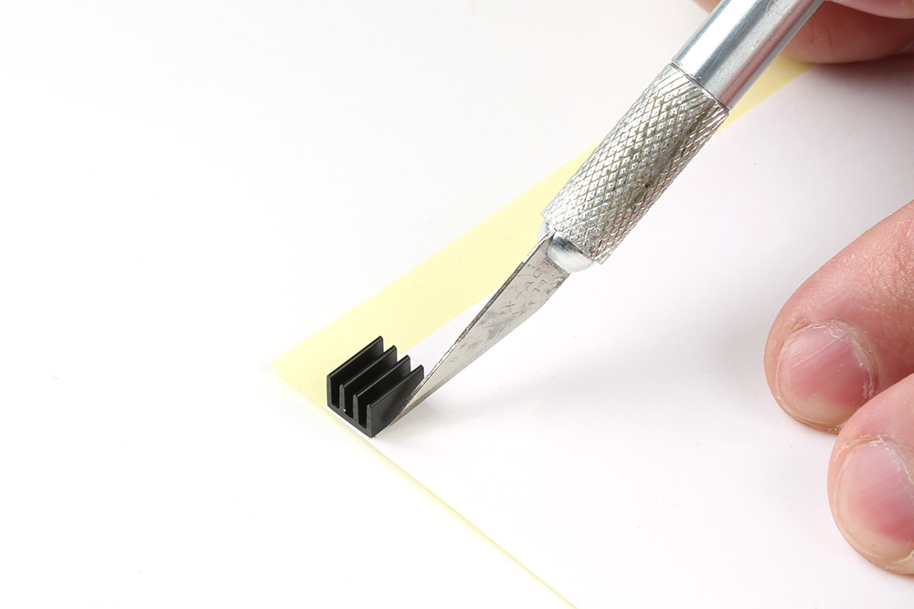
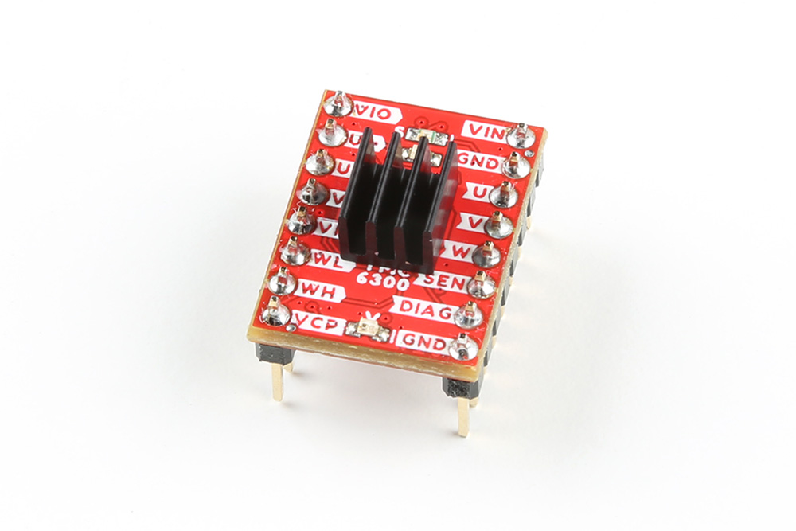
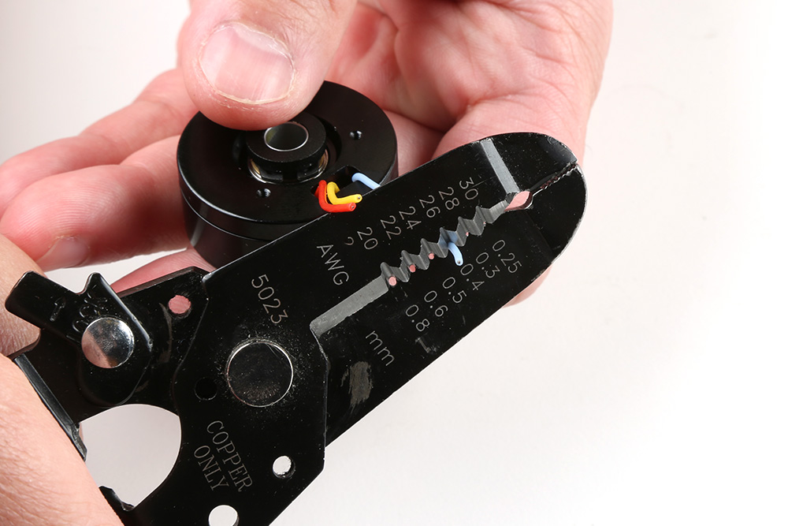

## TMC6300 Motor Driver

### :material-soldering-iron:&nbsp;Headers

??? note "New to soldering?"
	If you have never soldered before or need a quick refresher, check out our [How to Solder: Through-Hole Soldering](https://learn.sparkfun.com/tutorials/how-to-solder-through-hole-soldering) guide.
	

		<a href="https://learn.sparkfun.com/tutorials/5">How to Solder: Through-Hole Soldering 
		</a>
	

The pins on the SparkFun TMC6300 motor driver are broken out to 0.1"-spaced pins on the outer edges of the board. When selecting headers, be sure you are aware of the functionality and board orientation required.

<figure markdown>
[{ width="200" }](../img/hookup_guide/assembly-header.jpg "Click to enlarge")
<figcaption markdown>
Soldering headers to the TMC6300 motor driver.
</figcaption>
</figure>

!!! tip
	Please be aware that the side of the board with the silkscreen labeld for the pins and the heat sink pad is, technically the top side of the board when in use.

	

	-	<figure markdown>
		[{ width="200" }](../img/hookup_guide/top.jpg "Click to enlarge")
		<figcaption markdown>
		Top side of the TMC6300 motor driver.
		</figcaption>
		</figure>

	-	<figure markdown>
		[{ width="200" }](../img/hookup_guide/bottom.jpg "Click to enlarge")
		<figcaption markdown>
		Bottom side of the TMC6300 motor driver.
		</figcaption>
		</figure>

	

!!! info "Staggered PTH Pins"
	The pins on the board may appear to be offset or crooked; this is by design, we stagger the holes along a specific center alignment. This reduces the geometric tolerance between the holes and header pins along a single axis, which helps to hold the header in place and keeps the pins more orthogonal to the board when soldering.

### Heat Sink

!!! tip
    With larger heat sinks, we recommend a test fit and attaching it last to avoid conflicts with other parts of the board. For example, the heat sink could block the PTH pins/slots or access to the jumper pad.

	!!! warning "Copper Heat Sink"
		Users may be tempted to use our [copper heatsink](https://www.sparkfun.com/products/18704) on their board. However, we highly advise against using the copper heat sink because it barely fits and will likely cause a short across one of the pins.

		

		-   <figure markdown>
			
			<figcaption markdown>
			Different [heat sinks](https://www.sparkfun.com/categories/tags/heatsink) next to the TMC6300 motor driver.
			</figcaption>
			</figure>

		-   <figure markdown>
			[{ width="200" }](../img/hookup_guide/assembly-heat_sink_bad.jpg "Click to enlarge")
			<figcaption markdown>
			Copper heat sink not fitting on the TMC6300 motor driver.
			</figcaption>
			</figure>
		
		

		

		<table class="pdf">
			<tr>
				<td align="center">
					 
					<i>Different <a href="https://www.sparkfun.com/categories/tags/heatsink">heat sinks</a> next to the TMC6300 motor driver.</i>
				</td>
				<td align="center">
					 
					<i>Copper heat sink not fitting on the TMC6300 motor driver.</i>
				</td>
			</tr>
		</table>
		

To attach a [heat sink](https://www.sparkfun.com/products/11510) to the board, users will also need a piece of [thermal tape](https://www.sparkfun.com/products/17054). We recommend the following procedure:

1. Cut out a piece of [thermal tape](https://www.sparkfun.com/products/17054) to fit the bottom of the [heat sink](https://www.sparkfun.com/products/11510).
	
	!!! tip
		Covering the entire bottom of the heat sink can insulate the electrical contacts on the board from shorting.

    * For a perfect fit, users can place the heat sink over the tape and trace the outline to cut with scissors.
    * For a perfect fit, users can also place the heat sink over the tape and cut the outline with a [hobby knife](https://www.sparkfun.com/products/9200).

	<figure markdown>
	[{ width="200" }](../img/hookup_guide/assembly-cut_thermal_tape.jpg "Click to enlarge")
	<figcaption markdown>
	Cutting the [thermal tape](https://www.sparkfun.com/products/17054) to fit the [heat sink](https://www.sparkfun.com/products/11510).
	</figcaption>
	</figure>

2. Place the piece of thermal tape on the bottom of the heat sink.

	!!! tip
		We recommend peeling off just one side of the backing sheet or [release liner](https://en.wikipedia.org/wiki/Release_liner) to place the thermal tape on the heat sink. Users can then peel the other side off when they are ready to place the heat sink on their board.
	
3. Attach the heat sink to the board.
    * Make sure to make any jumper modifications and/or solder any connections before placing the heat sink on the board.
    * Make sure to avoid any electrical contact with the sides of the heat sink.

	<figure markdown>
	[{ width="200" }](../img/hookup_guide/assembly-heat_sink.jpg "Click to enlarge")
	<figcaption markdown>
	[Heat sink](https://www.sparkfun.com/products/11510) attached to the TMC6300 motor driver.
	</figcaption>
	</figure>

## BLDC Gimbal Motor

!!! warning "Advanced Skills Required"
	To connect the gimbal motor to the TMC6300 motor driver board, some advanced soldering and wire stripping skills are necessary. The wire leads from the motor are only about 2" long, which is not a lot to work with. Users may only have two attempts at stripping the wires before they run out the available wire length.

??? note "New to soldering?"
	If you have never soldered before or need a quick refresher, check out our [How to Solder: Through-Hole Soldering](https://learn.sparkfun.com/tutorials/how-to-solder-through-hole-soldering) guide.
	

		<a href="https://learn.sparkfun.com/tutorials/5">How to Solder: Through-Hole Soldering 
		</a>
	

To connect the gimbal motor to the TMC6300 motor driver, users will need to expose the wiring. First, remove the JST connector and make sure to cut as close to the plastic housing as possible.

<figure markdown>
[{ width="200" }](../img/hookup_guide/motor-remove_connector.jpg "Click to enlarge")
<figcaption markdown>
Cut off the plastic JST connector on the motor's wire leads.
</figcaption>
</figure>

??? info "Alternative Connections"
	If users are utilize the alligator or IC hook pigtails, they may be able to crack the plastic housing of the connector to expose the crimped wire terminals.

Next, with as much care as possible, strip off some of the electrical insulation of each of the leads. On our [wire strippers](https://www.sparkfun.com/products/15220), the 26AWG notch worked the best.

<figure markdown>
[{ width="200" }](../img/hookup_guide/motor-strip_wire.jpg "Click to enlarge")
<figcaption markdown>
Strip off some of the insulation from the motor's wire leads.
</figcaption>
</figure>

The last step is to twist and tin the wires, so that they can be inserted into some jumper wires. Make sure to keep the ends straight and avoid adding to much solder, so that the wire ends can still fit into the female jumper wire terminals.

<table class="pdf">
	<tr>
		<td align="center">
			 
			<i>Twist and tin the exposed wire leads, so that they can be inserted into the female end of a jumper wire.</i>
		</td>
		<td align="center">
			 
			<i>The leads should be straight and clear of bulges fit the into female terminals.</i>
		</td>
	<tr>
</table>

-   <figure markdown>
	
	<figcaption markdown>
	Twist and tin the exposed wire leads, so that they can be inserted into the femal end of a jumper wire.
	</figcaption>
	</figure>

-   <figure markdown>
	
	<figcaption markdown>
	The leads should be straight and clear of bulges fit the female terminals of the jumper wire.
	</figcaption>
	</figure>

