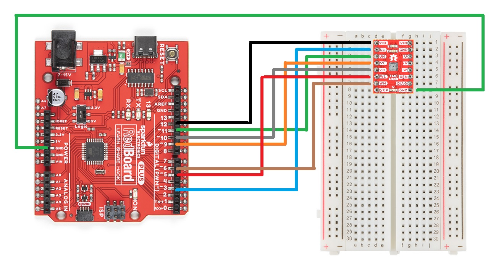
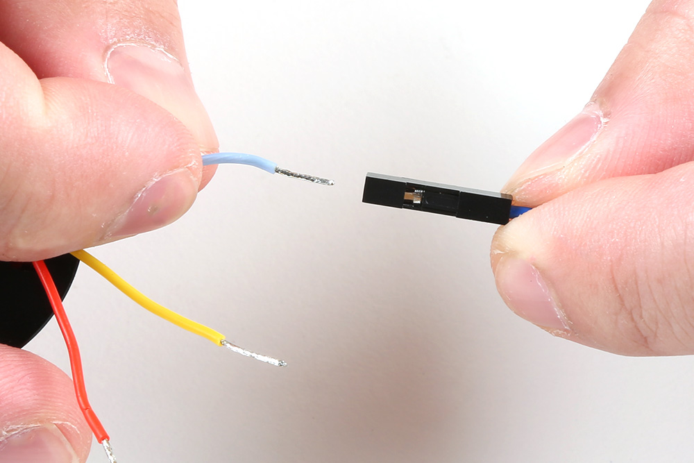
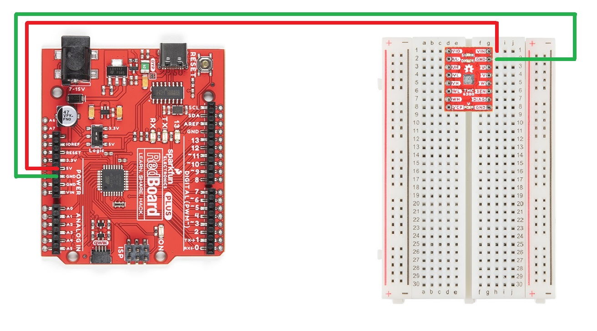

## Assembly for Examples
The following instructions are for wiring up the RedBoard Plus, TMC6300 motor driver, and motor for the examples provided in this tutorial. 

### RedBoard Plus to TMC6300

For ease of use, connect the TMC6300 motor driver with headers attached to the center of breadboard. The pin layout should perfectly align, so that users will have three breadboard pins available on each side of the TMC6300 breakout board. Then, following the table below, connect the pins from the RedBoard Plus to breadboard pins associated with the motor driver.

| RedBoard     | `3`  | `5`  | `6`  | `9`  | `10` | `11` | `12`  | `GND` |
| :----------- | :--: | :--: | :--: | :--: | :--: | :--: | :---: | :---: |
| Motor Driver | `UL` | `WL` | `WH` | `VL` | `VH` | `UH` | `VIO` | `GND` |

<figure markdown>
[{ width="200" }](../img/hookup_guide/wiring-to_redboard.jpg "Click to enlarge")
<figcaption markdown>
A graphical representation of the connections between the [RedBoard Plus](https://www.sparkfun.com/products/18158) and a [breadboard](https://www.sparkfun.com/products/12002) with the [TMC6300 motor driver](https://www.sparkfun.com/products/21867) attached.
</figcaption>
</figure>

!!! info "Timer Pins"
	As mentioned in the [Simple FOC library documentation](https://docs.simplefoc.com/bldcdriver6pwm#arduino-uno-support), 

	<blockquote markdown>
	--8<-- "https://raw.githubusercontent.com/simplefoc/simplefoc.github.io/master/docs/simplefoc_library/code/drivers/bldc_driver/bldc_driver_6pwm.md:41:50"
	</blockquote>

### Motor to TMC6300

Connecting a motor to the TMC6300 motor driver straight forward. Users, just need to connect the half-bridge drive channels with the ends of the motor's stator coils.

* [Utilizing two half-bridges to drive a brushed DC motor with a full H-bridge](https://fab.cba.mit.edu/classes/865.21/topics/power_electronics/architectures/#h-bridges)
* [Utilizing three half-bridges to drive a brushless DC motor](https://fab.cba.mit.edu/classes/865.21/topics/power_electronics/architectures/#triple-half-bridges)

#### BLDC Gimbal Motor

Connecting a 3-phase, [BLDC](https://en.wikipedia.org/wiki/Brushless_DC_electric_motor "brushless DC") motor to the motor driver is relatively simple as the sequence of the wires connection doesn't matter. Using jumper wires, connect the [prepared ends of the gimbal stabilizer motor](../component_assembly/#bldc-gimbal-motor) to the [`U`, `V`, and `W` pins of the TMC6300 breakout board](../hardware_overview/#__tabbed_1_2).

<figure markdown>
[{ width="200" }](../img/hookup_guide/motor-connect_jumper_wire.jpg "Click to enlarge")
<figcaption markdown>
A prepared end of the gimbal motor being inserted into the female terminals of a jumper wire.
</figcaption>
</figure>

!!! tip 
	Users may want to prop up the base of the gimbal motor, as the magnetic end of the motor shaft protudes below its base plate. Users can see a demonstration in the video below:

	

	[:material-youtube:{ .heart } Video with Gimbal Motor ](https://youtu.be/Q76dMggUH1M?t=233){ .md-button .md-button--primary }
	

??? info "Reversing the Rotation of the Motor"
	For a 3-phase brushless motor, the connection sequence of the wires to a BLDC motor doesn't necessarily matter; the direction that the motor spins can be controlled through the software. However, for reference, switching two of the output channels to the motor will automatically reverse the direction that the motor was spinning.

	* If users swap just the `U` and `V` connections, leaving the `W` connection alone, the motor will now spin in the opposite direction of the original configuration.

#### DC Hobby Motor

If this was a H-bridge motor driver, the connections to the motor wouldn't matter. However, as there are three half-bridges, users will need to note which half-bridges the DC motor is connected to. These connections will dictate how the motor is driven by the software. For the example, connect the motor to the `V` and `W` output channels of the TMC6300 motor driver.

??? info "Reversing the Rotation of the Motor"
	For a  single phase DC motor, the direction that the motor spins can be controlled through the software. However, for reference, switching the polarity of the motor's wires will also reverse the direction that the motor was spinning.

### Powering the TMC6300

Enough power should be provided to the TMC6300 to drive the motor connected to it. Therefore, the drive current and voltage range of the motor should be taken into consideration. Additionally, users should monitor the drive current to prevent overheating of the TMC6300 motor driver.

Ideally, if users have access to a variable power supply, it would be the most convenient solution for adjusting the voltage and source current parameters. Other power supply alternatives include a 6V (4xAA) battery pack or dual-cell LiPo battery. However, if users are unable to find a suitable power source, we have found that the 5V power output from the RedBoard Plus is sufficient to drive the gimbal motor, under a no load condition at low speeds.

| RedBoard     | `5V`  | `GND` |
| :----------- | :---: | :---: |
| Motor Driver | `VIN` | `GND` |

<figure markdown>
[{ width="200" }](../img/hookup_guide/wiring-redboard_power.jpg "Click to enlarge")
<figcaption markdown>
A graphical representation of the connections between the [RedBoard Plus](https://www.sparkfun.com/products/18158) and a [breadboard](https://www.sparkfun.com/products/12002) with the [TMC6300 motor driver](https://www.sparkfun.com/products/21867) attached.
</figcaption>
</figure>

??? tip "Current Monitoring"
	For the examples in this tutorial, the motor will be driven with a no-load condition and the motor drive current shouldn't need to be monitored. *(An exception would be when the motor is hindered from spinning, in which case the torque and drive current will spike.)*
