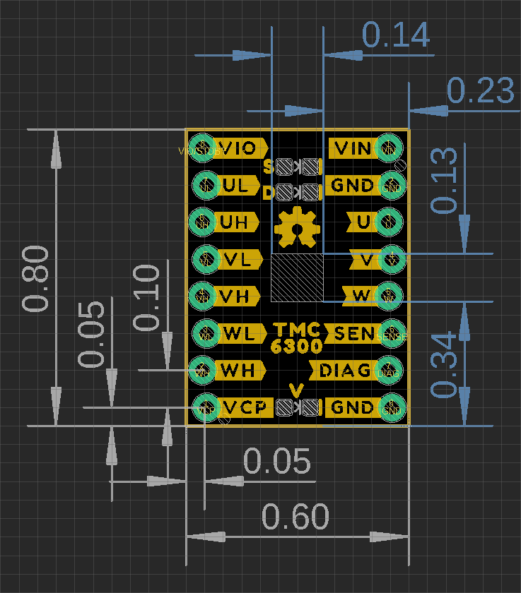
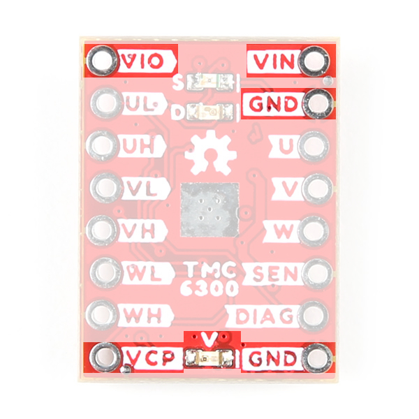
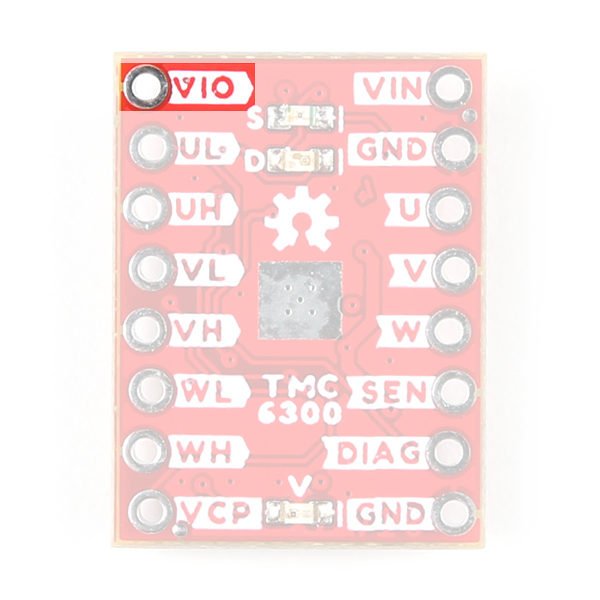
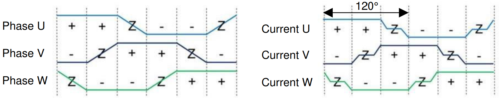
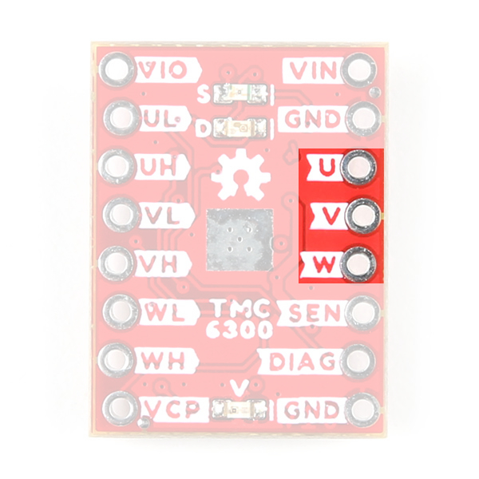
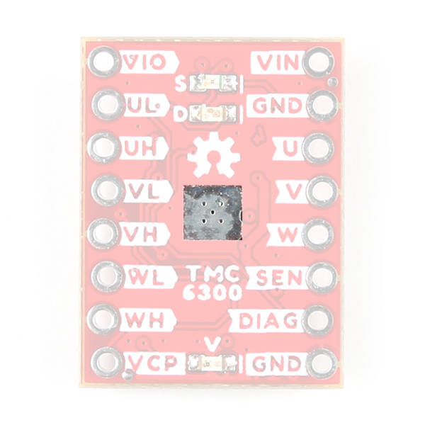

## Board Dimensions

The board dimensions are illustrated in the drawing below; the listed measurements are in inches.

<figure markdown>
[{ width="400" }](../img/hookup_guide/dimensions.png "Click to enlarge")
<figcaption markdown>
[Board dimensions (PDF)](../board_files/dimensions.pdf) for the TMC6300 motor driver breakout board, in inches.
</figcaption>
</figure>

??? tip "Need more measurements?"
	For more information about the board's dimensions, users can download the [eagle files](../board_files/eagle_files.zip) for the board. These files can be opened in Eagle and additional measurements can be made with the dimensions tool.

	??? info ":octicons-download-16:{ .heart } Eagle - Free Download!"
		Eagle is a [CAD]("computer-aided design") program for electronics that is free to use for hobbyists and students. However, it does require an account registration to utilize the software.

		

		[Download from :autodesk-primary:{ .autodesk }](https://www.autodesk.com/products/eagle/free-download "Go to downloads page"){ .md-button .md-button--primary width="250px" }
		

	
	??? info ":straight_ruler: Dimensions Tool"
		This video from Autodesk demonstrates how to utilize the dimensions tool in Eagle, to include additional measurements:

		

		

		<iframe src="https://www.youtube.com/embed/dZLNd1FtNB8" title="EAGLE Dimension Tool" frameborder="0" allow="accelerometer; autoplay; clipboard-write; encrypted-media; gyroscope; picture-in-picture" allowfullscreen></iframe>
		

		{ .qr }
		

## Power

Users are provided with [PTH](https://en.wikipedia.org/wiki/Through-hole_technology "Plated Through Holes") to connect their external power supply, I/O logic-level voltage, and the regulated 1.8V output. The TMC6300 motor driver has an input voltage range of **2.0V** to **11.0V**.

<figure markdown>
[{ width="200"}](../img/hookup_guide/power_connections.jpg "Click to enlarge")
<figcaption markdown>
The power connections on the TMC6300 motor driver.
</figcaption>
</figure>

Below, is a general summary of the circuitry on the board:

* **`VIN`** - Power supply input
    * Range: **2 to 11V**
* **`VIO`** - I/O supply voltage
	* Range: **1.8 to 5.25V**
	* `NSTDBY` - IC goes to standby mode and resets when this pin is pulled to `GND`
* **`VCP`** - Charge pump voltage
* **`GND`** - The common ground or the 0V reference for the board

!!! info
	For more details, users can reference the [schematic](../board_files/schematic.pdf) and the [TMC6300 datasheets](../component_documentation/TMC6300.pdf).

??? caution "Motor Voltage"
	Even though the input voltage range for the motor driver goes down to 2V, users will need to provide the minimum operating voltage for their motor. *Our [Gimbal Stabilizer Motor](https://cdn.sparkfun.com/assets/e/b/2/8/3/OT-EM3215_DC_Brushless_Gimbal_Motor_3_Phase_Datasheet.pdf) has an operating voltage range of 6 - 8V.*

### Power LED

The red, power (`PWR`) LED will light up when a power supply is connected to the board. However, the LED can be disabled for low-power applications by cutting the [jumper](#jumper).

<figure markdown>
[{ width="200" }](../img/hookup_guide/LED_pwr.jpg "Click to enlarge")
<figcaption markdown>
The `PWR` status LED indicator for the TMC6300 motor driver.
</figcaption>
</figure>

### `VIO`/Standby Pin

In it's default configuration, the `VIO` pin is used to enable the motor driver and set the logic level voltage (**1.8** to **5.25V**) for the I/O pins. However, the `VIO` pin also operates as a standby pin when it is pulled `LOW`. In standby, the TMC6300 resets and sits in standby mode.

<figure markdown>
[{ width="200"}](../img/hookup_guide/pin-vio.jpg "Click to enlarge")
<figcaption markdown>
`VIO` pin on the TMC6300 motor driver.
</figcaption>
</figure>

### `VCP`&nbsp;Pin

The `VCP` pin is broken out for users to include an external charge pump capacitor. Adding an external capacitor would help stabilize the supply voltage, from the large voltage swings (dV/dt) of the motor driver's operation. A 1nF to 100nF capacitor rated at 10V, is recommended by the [datasheet](./component_documentation/TMC6300.pdf).

<figure markdown>
[{ width="200"}](../img/hookup_guide/pin-vcp.jpg "Click to enlarge")
<figcaption markdown>
`VCP` pin on the TMC6300 motor driver.
</figcaption>
</figure>

## :fontawesome-solid-microchip:&nbsp;TMC6300

The [TMC6300](../component_documentation/TMC6300.pdf) from [Trinamic Motion Control](https://www.trinamic.com/), part of Analog Devices, is a low voltage, 3-Phase [BLDC](https://en.wikipedia.org/wiki/Brushless_DC_electric_motor "Brushless DC")/[PMSM](https://en.wikipedia.org/wiki/Synchronous_motor#Permanent-magnet "Permanent-Magnet Synchronous Motor") motor driver utilizing separate high-side and low-side control signals for its three half-bridges.

<table class="pdf" markdown="1">
<tr markdown="1">
<td markdown="block">
Features:

* VIN: 2.0V to 11.0V
	* Operating current: 7mA
	* Standby current: 30nA
* VOUT: 1.8V
* 3 Half-Bridges
	* 3 High-side MOSFETs
	* 3 Low-side MOSFETs
* I/O Supply Voltage Input
* Diagnostic Output
* Overtemperature Protection
	* Shutdown Temperature: 150&deg;C
	* Typical Power Dissipation: 1W
* Short Protection

</td>
<td align="center">
 
<i>TMC6300 chip on the TMC6300 motor driver.</i>
</td>
</tr>
</table>

-   Features:

	* VIN: 2.0V to 11.0V
		* Operating current: 7mA
		* Standby current: 30nA
	* VOUT: 1.8V
	* 3 Half-Bridges
		* 3 High-side MOSFETs
		* 3 Low-side MOSFETs
	* I/O Supply Voltage Input
	* Diagnostic Output
	* Overtemperature Protection
		* Shutdown Temperature: 150&deg;C
		* Typical Power Dissipation: 1W
	* Short Protection

-	<figure markdown>
	[{ width="200"}](../img/hookup_guide/TMC6300.jpg "Click to enlarge")
	<figcaption markdown>
	TMC6300 chip on the TMC6300 motor driver.
	</figcaption>
	</figure>

!!! info
	For more details, please refer to the [TMC6300 datasheet](../component_documentation/TMC6300.pdf) and [application note](../component_documentation/AN_AP3428.pdf).

??? warning "Chip Protections"
	The TMC6300 features the overtemperature and short protections:

	* The overtemperature protection feature implements a two temperature thresholds; however, the datasheet warns users that this should only be relied on as an emergency percaution and may not prevent the destruction of the IC. This is due to several factors including that excess heat can generate quickly before the overtemperature sensor can react. Therefore, users should prevent this situation from occuring by design with methods such as adequate heat dissipation.
	* The short protection feature gaurds the motor commutation channels by monitoring the current flowing through each of the power stage MOSFETs. Once a short condition (short to `GND` or `VS`) is safely detected, all driver bridges become switched off, and the `DIAG` output becomes set. In order to restart the motor, the users must must disable and restart the TMC6300. As with the overtemperature protection, the datasheet warns users that this feature should only be relied on as an emergency percaution and may not prevent the destruction of the IC or detect all possible short events.

	*By monitoring the current draw through the `SEN` pin, users can also implement an over current protection scheme in their software. This can also aid in preventing a trigger in the overtemperature protection and validating a short detection.*

??? tip "Maximum Load Current"
	When pushing the maximum load current of 2A, users should monitor the current draw through the `SEN` pin and add a heat sink to provide additional heat dissipation. This should precautions can help to avoid damaging the IC.

### Motor Commutation

The TMC6300 relies on an electrical [commutation](https://fab.cba.mit.edu/classes/865.21/topics/power_electronics/commutation/#bldc-commutation) sequence/signal to drive the motor phases to a [BLDC](https://en.wikipedia.org/wiki/Brushless_DC_electric_motor "brushless DC") or [PMSM](https://en.wikipedia.org/wiki/Synchronous_motor#Permanent-magnet "permanent magnet synchronous motor") motor. The commutation signals for these motors are trapezoidal for BLDC motors and sinusoidal for PMSM motors.

-	<figure markdown>
	
	<figcaption markdown>
	Trapezoidal motor commutation.
	</figcaption>
	</figure>

-	<figure markdown>
	
	<figcaption markdown>
	Sinusoidal motor commutation.
	</figcaption>
	</figure>

*(Source: [Brushless-DC Motor Driver Considerations and Selection Guide](https://www.ti.com/lit/an/slvaes1a/slvaes1a.pdf) application note)*

For a trapezoidal signal, the high-side (HS) and low-side (LS) MOSFETs, can just be driven high or low. However, in order to approximate a sinusoidal signal, a progressively varying PWM signal must be provided from the microcontroller and all six signal should be in sync with each other.

<figure markdown>
[{ width="300" }](../img/hookup_guide/pwm-sine_wave.png "Click to enlarge")
<figcaption markdown>
Sinusoidal PWM signal. 
(Source: [Demystifying BLDC motor commutation: Trap, Sine, & FOC](https://www.ti.com/lit/ml/slyp711/slyp711.pdf))
</figcaption>
</figure>

??? info "PMSM vs BLDC Motor"
	A BLDC motor (sometimes referred to as a BLDM) and a PMSM (sometimes referred to as an AC synchronus motor) for the most part will appear the same in their internal construction. The difference between these types of motors is in their stator windings. This means that their commutation (the electrical signals used to drive the motor) is different.

	* In a BLDC motor, the windings are concentrated on salient poles, requiring a voltage waveform that's more trapeziodal than sinusoidal.
	* In a PMSM, the windings are distributed over several poles, requiring a voltage waveform that's more more sinusoidal.

	!!! tip "Gimbal Motor"
		Based on measuring the output from one of the coils, our gimbal motor is a PMSM and would require a sinusoidal waveform to drive the motor. It should be noted that a trapezodial waveform can probably be used; however, users may notice effects such as cogging.

??? tip "Alternative Use Cases"
	While this IC is intended to be used to drive 3-Phase BLDC/PMSM motors, users can easily adapt their hardware and software to work with other moters. For example, users could use two half-bridges to form an H-bridge and adapt their control software to drive a brushed, DC motor.

## I/O Pins

There are several I/O pins for the TMC6300. Some of the pins are detailed in the [power section](#power) above; the `VOUT` pin is ommitted because it isn't broken out.

### Half-Bridges

The TMC6300 features high-side and low-side MOSFET pairs of the three available half-bridges which control the commutation of the three motor phases.

<figure markdown>
[{ width="300"}](../img/hookup_guide/block_diagram-half_bridges.png "Click to enlarge")
<figcaption markdown>
6 PWM control of a 3-phase motor commutation. 
(Source: Modified from the [Block commutation vs. FOC in power tool motor control](https://www.infineon.com/dgdl/Infineon-Motor_power_tool_Block_Commutation_vs_FOC-ApplicationNotes-v01_00-EN.pdf?fileId=5546d4626eab8fbf016ed37fee474a65) application note)
</figcaption>
</figure>

=== "Input"
	The electronic commutation sequence of these pins will depend on the motor that is connected. For most cases, users will provide a PWM signal to each of the pins. *These are active-high pins with logic levels controlled by the `VIO` pin.*

	<figure markdown>
	[{ width="300"}](../img/hookup_guide/pin-half_bridge_inputs.jpg "Click to enlarge")
	<figcaption markdown>
	The six control pins (`UL`/`UH`, `VL`/`VH`, and `WL`/`WH`) for the three half-bridges of the TMC6300 motor driver.
	</figcaption>
	</figure>

	??? info "Active High"
		By pulling the pin high, the MOSFET will enable power to flow through that section of the half-bridge.
	
	??? tip "Microcontroller Limitations"
		Users will need to use pins capable of providing a PWM signal. In addition, for the recommended [Simple FOC Arduino library](https://github.com/simplefoc/Arduino-FOC), users will also need to consider the [supported microcontroller](https://docs.simplefoc.com/microcontrollers) as well as the configuration for the [6PWM mode](https://docs.simplefoc.com/bldcdriver6pwm#step-1-hardware-setup).

=== "Output"
	With the electronic commutation sequence provided to the half-bridges, the output motor phases will drive a connected motor.

	<figure markdown>
	[{ width="300"}](../img/hookup_guide/pin-half_bridge_outputs.jpg "Click to enlarge")
	<figcaption markdown>
	The three motor phase outputs (`U`/`V`/`W`) from the TMC6300, used to drive a motor.
	</figcaption>
	</figure>

	??? info "Wiring Sequence"
		For a 3-phase brushless motor, the connection sequence of the wires to a BLDC motor doesn't necessarily matter; the direction that the motor spins can be controlled through the software. However, for reference, switching two of the output channels to the motor will automatically reverse the direction that the motor was spinning.

		* If users swap the `U` and `V` connections, but leave the `W` connection alone, the motor will now spin in the opposite direction of the original configuration.

### Diagnostic Pin

The diagnostic pin is triggered based on different faults *(i.e. shorts and overtemperature)* detected by the IC. By default, the status will be indicated by the, green diagnostic, `D` LED and will remail `LOW` until triggered. Once triggered, users will need to disable and reset the TMC6300 or power cycle the board.

<figure markdown>
[{ width="200" }](../img/hookup_guide/pin-diag.jpg "Click to enlarge")
<figcaption markdown>
The `DIAG` pin on the TMC6300 motor driver.
</figcaption>
</figure>

Users can also monitor the `DIAG` pin, so their microcontroller knows when to reset the TMC6300 to clear the fault.

### Current Sense Pin

<figure markdown>
[{ width="200" }](../img/hookup_guide/pin-sen.jpg "Click to enlarge")
<figcaption markdown>
The `SEN` pin on the TMC6300 motor driver.
</figcaption>
</figure>

## LEDs

There are three status indicator LEDs on the TMC6300 motor driver:

* `V` - Power *(Red)*
	* Turns on once power is supplies to the `VIN` pin
* `D` - Diagnostics *(Green)*
	* Turns on to indicate a fault *(see [diagnostic pin](#diagnostic-pin) section)*
* `S` - Standby *(Blue)*
	* Turns on when the motor driver is enabled
	* Turns off, when the IC has been reset and the motor driver is in standby mode

<figure markdown>
[{ width="200"}](../img/hookup_guide/LEDs.jpg "Click to enlarge")
<figcaption markdown>
The status indicator LEDs on the TMC6300 motor driver.
</figcaption>
</figure>

## Heat Sink Pad

A 0.13" x 0.14" platted copper pad is provided on the top of the board, where users can add a heat sink to dissipate excess heat generated by the TMC6300. The pad can accommodate the [small heatsink](https://www.sparkfun.com/products/11510) in our catalog.

??? info "Thermal Shutdown Temperature"
	The AP329A has a 160&deg;C (320&deg;F) thermal shutdown temperature. The TMC6300 will restart automatically when the junction temperature decreases to +130°C.

??? warning "Copper Heat Sink"
	Users may be tempted to use our [copper heatsink](https://www.sparkfun.com/products/18704) on their board. However, we highly advise against using the copper heatsink because it barely fits and will likely cause a short across one of the pins.

	<figure markdown>
	[{ width="200" }](../img/hookup_guide/assembly-heat_sink_bad.jpg "Click to enlarge")
	<figcaption markdown>
	Copper heatsink not fitting on the TMC6300 motor driver.
	</figcaption>
	</figure>

<figure markdown>
[{ width="200" }](../img/hookup_guide/heat_sink.jpg "Click to enlarge")
<figcaption markdown>
Heat sink pad on the top of the TMC6300 motor driver.
</figcaption>
</figure>

## Jumpers

??? note "Never modified a jumper before?"
	Check out our <a href="https://learn.sparkfun.com/tutorials/664">Jumper Pads and PCB Traces tutorial</a> for a quick introduction!
	

		<a href="https://learn.sparkfun.com/tutorials/664">How to Work with Jumper Pads and PCB Traces 
		</a>
	

There are three jumpers on the back of the board that can be used to easily modify a hardware connections on the board.

* **V** - This jumper can be used to remove power from the red, power LED.
* **S** - This jumper can be used to remove power from the blue, standby LED.
* **D** - This jumper can be used to remove power from the green, diagnostic LED.

<figure markdown>
[{ width="200" }](../img/hookup_guide/jumpers.jpg "Click to enlarge")
<figcaption markdown>
The LED jumpers on the back of the TMC6300 motor driver.
</figcaption>
</figure>
