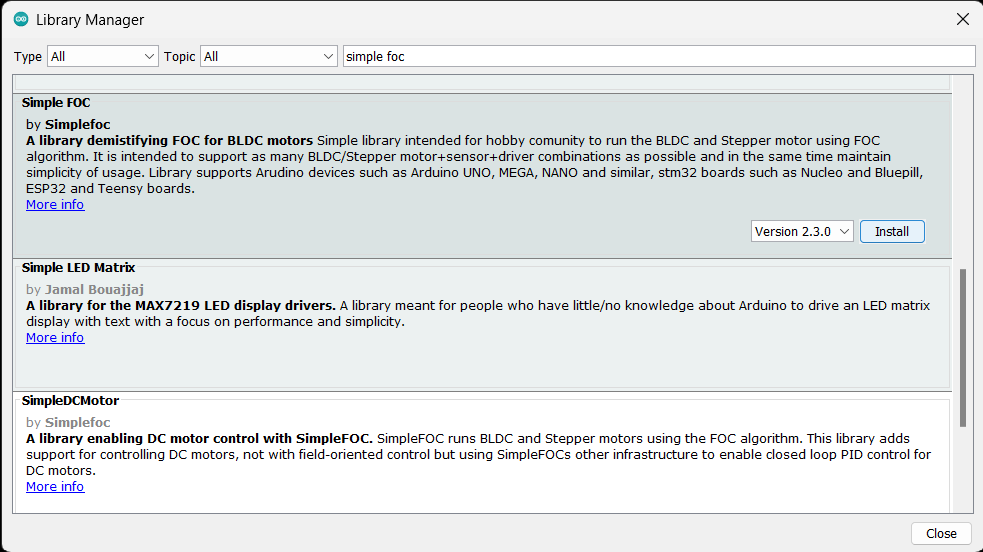

## Arduino IDE
!!! tip
	For first-time users, who have never programmed before and are looking to use the Arduino IDE, we recommend beginning with the <a href="https://www.sparkfun.com/products/15631">SparkFun Inventor's Kit (SIK)</a>, which is designed to help users get started programming with the Arduino IDE.

Most users may already be familiar with the Arduino IDE and its use. However, for those of you who have never heard the name *Arduino* before, feel free to check out the [Arduino website](https://www.arduino.cc/en/Guide/HomePage). To get started with using the Arduino IDE, check out our tutorials below:

<table class="pdf" style="border-style:none" align="center">
	<tr>
		<td align="center">
			<a class="thumb" href="https://learn.sparkfun.com/tutorials/50">
				
				<h3 class="title">What is an Arduino?</h3>
			</a>
		</td>
		<td align="center">
			<a class="thumb" href="https://learn.sparkfun.com/tutorials/61">
				
				<h3 class="title">Installing Arduino IDE</h3>
			</a>
		</td>
		<td align="center">
			<a class="thumb" href="https://learn.sparkfun.com/tutorials/15">
				
				<h3 class="title">Installing an Arduino Library</h3>
			</a>
		</td>
		<td align="center">
			<a class="thumb" href="https://learn.sparkfun.com/tutorials/1265">
				
				<h3 class="title">Installing Board Definitions in the Arduino IDE</h3>
			</a>
		</td>
	</tr>
</table>

-   <a href="https://learn.sparkfun.com/tutorials/50"><figure markdown>
	
	</figure>

	---

	**What is an Arduino?**</a>

-   <a href="https://learn.sparkfun.com/tutorials/61"><figure markdown>
	
	</figure>

	---
	
	**Installing the Arduino IDE**</a>

-   <a href="https://learn.sparkfun.com/tutorials/15"><figure markdown>
	
	</figure>

	---
	
	**Installing an Arduino Library**</a>

-   <a href="https://learn.sparkfun.com/tutorials/1265"><figure markdown>
	
	</figure>

	---
	
	**Installing Board Definitions in the Arduino IDE**</a>

??? tip "Need help setting up the RedBoard Plus?"
	### RedBoard Plus
	The following instructions should help users get started with the RedBoard Plus. For more information about the board, please check out our hookup guide below:

	<figure markdown>
	
	<figcaption markdown>[**RedBoard Plus Hookup Guide**](https://learn.sparkfun.com/tutorials/1758)</figcaption>
	</figure>

	#### CH340 Driver
	Users will need to install the appropriate driver for their computer to recognize the serial-to-UART chip on their board/adapter. Most of the latest operating systems will recognize the CH340C chip on the board and automatically install the required driver.

	*To manually install the CH340 driver on their computer, users can download it from the [WCH website](http://www.wch-ic.com/products/CH340.html?). For more information, check out our [How to Install CH340 Drivers Tutorial](https://www.sparkfun.com/ch340).*

	<figure markdown>
	
	<figcaption markdown>[**How to Install CH340 Drivers**](https://learn.sparkfun.com/tutorials/908)</figcaption>
	</figure>

	#### Arduino IDE
	When selecting a board to program in the Arduino IDE, users should select the **Arduino Uno** from the **Tools** drop-down menu _(_i.e. **Tools** > **Board** > **Arduino AVR Boards** > **Arduino Uno**)_.

	<figure markdown>
	[{ width="400" }](../img/hookup_guide/board_selection.png)
	<figcaption markdown>Select the **Arduino Uno** from the Tools drop-down menu in the Arduino IDE.</figcaption>
	</figure>

	??? info "Arduino IDE 2.x.x - *Alternative Method*"
		In the newest version of the Arduino IDE 2.`x`.`x`, users can also select their board (*green*) and port (*blue*) from the `Select Board & Port` dropdown menu (*yellow*).

		<figure markdown>
		[{ width="400" }](../img/hookup_guide/board_selection2.png)
		<figcaption markdown>Selecting the **Arduino Uno** and **COM5** port from the **Select Board & Port** drop-down menu in the Arduino IDE (v2.0.3).</figcaption>
		</figure>

## SimpleFOClibrary
The [Simple Field Oriented Control Library](https://github.com/simplefoc/Arduino-FOC) can be installed from the library manager in the Arduino IDE.

<figure markdown>
[{ width="400" }](../img/hookup_guide/arduino_library.png)
<figcaption markdown>SimpleFOClibrary in the library manager of the Arduino IDE.</figcaption>
</figure>

This library utilizes a motor control scheme called field oriented control (FOC), which can utilize a feedback control loop to drive a motor with a higher power efficiency and precision characteristics, like evenly distributed torque control.

!!! info
	For more details about the library, check out the [online documentation](https://docs.simplefoc.com/).

??? info "Supported Hardware"
    For a detailed and up-to-date list of the hardware supported by this library, check out the [library's documentation](https://docs.simplefoc.com/supported_hardware). The following are excerpts taken from the library's documentation page:

    === "Microcontrollers"

        --8<-- "https://raw.githubusercontent.com/simplefoc/simplefoc.github.io/master/docs/simplefoc_library/hardware/mcus/index.md:14:15"

        --8<-- "https://raw.githubusercontent.com/simplefoc/simplefoc.github.io/master/docs/simplefoc_library/hardware/mcus/index.md:16:49"

		!!! info
			For more details, please refer to the [SimpleFOC Arduino library docmentation](https://docs.simplefoc.com/microcontrollers).
    
    === "Motor Drivers"

		--8<-- "https://raw.githubusercontent.com/simplefoc/simplefoc.github.io/master/docs/simplefoc_library/hardware/drivers/index.md:19:24"

		??? warning "Current Limitations"
            --8<-- "https://raw.githubusercontent.com/simplefoc/simplefoc.github.io/master/docs/simplefoc_library/hardware/drivers/index.md:29"

		--8<-- "https://raw.githubusercontent.com/simplefoc/simplefoc.github.io/master/docs/simplefoc_library/hardware/drivers/BLDC_drivers.md:12:23"

		| Examples | Description | Price |
		| ---- | ---- | --- |
		| | Arduino  SimpleFOCShield v1 | 15€ |
		| | Arduino  SimpleFOCShield v2 | ~20€ |

		!!! info
			For more details, please refer to the [SimpleFOC Arduino library docmentation](https://docs.simplefoc.com/bldc_drivers).

    === "Motors"

        Arduino SimpleFOClibrary supports two types of BLDC motors:

        - [BLDC motors](#bldc-motors) 
            - 3 phase (3 wire):
            - Gimbal and High-performance BLDC motors
        - Stepper motors
            - 2 phase (4 wire)

        ??? warning "Current Limitations"
            --8<-- "https://raw.githubusercontent.com/simplefoc/simplefoc.github.io/master/docs/simplefoc_library/hardware/motors/index.md:27"

        --8<-- "https://raw.githubusercontent.com/simplefoc/simplefoc.github.io/master/docs/simplefoc_library/hardware/motors/BLDC_motors.md:12:14"

        --8<-- "https://raw.githubusercontent.com/simplefoc/simplefoc.github.io/master/docs/simplefoc_library/hardware/motors/BLDC_motors.md:15:16"
        --8<-- "https://raw.githubusercontent.com/simplefoc/simplefoc.github.io/master/docs/simplefoc_library/hardware/motors/BLDC_motors.md:17:22"

        --8<-- "https://raw.githubusercontent.com/simplefoc/simplefoc.github.io/master/docs/simplefoc_library/hardware/motors/BLDC_motors.md:23:28"

        --8<-- "https://raw.githubusercontent.com/simplefoc/simplefoc.github.io/master/docs/simplefoc_library/hardware/motors/BLDC_motors.md:42:43"

		!!! info
			For more details, please refer to the [SimpleFOC Arduino library docmentation](https://docs.simplefoc.com/bldc_motors).

<!-- ??? note "Hardware Specific Considerations"
	https://docs.simplefoc.com/bldcdriver6pwm#arduino-uno-support

	--8<-- "https://raw.githubusercontent.com/simplefoc/simplefoc.github.io/master/docs/simplefoc_library/code/drivers/bldc_driver/bldc_driver_6pwm.md:41:110" -->

??? tip "Arduino IDE *(v1.x.x)*"
	In the Arduino IDE v1.x.x, the library manager will have the following appearance for the SimpleFOC library:

	<figure markdown>
	[{ width="400" }](../img/hookup_guide/arduino_library-legacy.png)
	<figcaption markdown>SimpleFOClibrary in the library manager of the Arduino IDE (v1.x.x).</figcaption>
	</figure>

